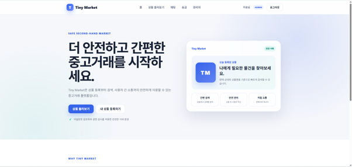
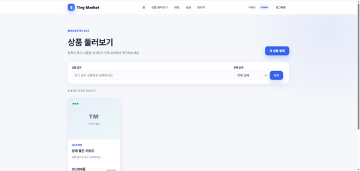
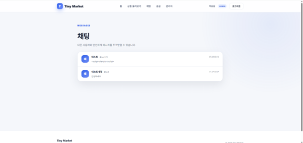
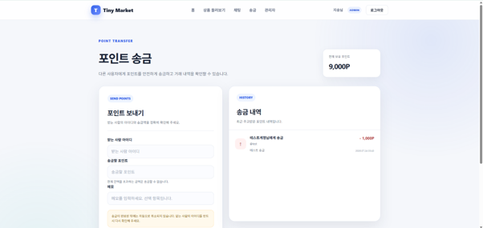
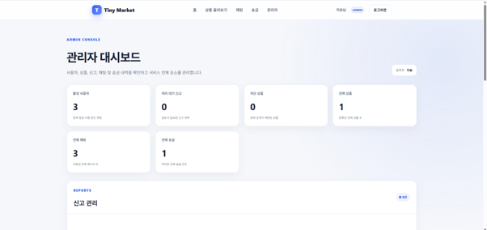
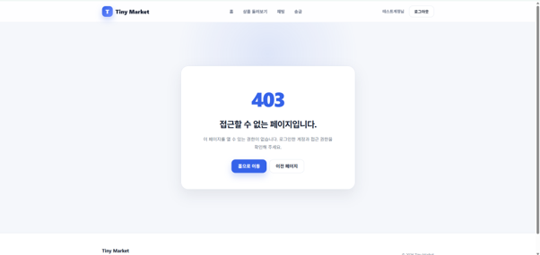

# Tiny Market

Flask 기반의 시큐어 코딩 중고거래 플랫폼입니다.

사용자 가입, 상품 등록 및 검색, 1:1 채팅, 사용자 간 포인트 송금, 악성 사용자·상품 신고 및 차단, 관리자 통합 관리 기능을 구현했습니다. 기능 구현뿐만 아니라 인증·인가, CSRF, XSS, SQL Injection, 안전하지 않은 리다이렉트, 세션 및 쿠키 보안, 송금 무결성 등 주요 웹 보안 위협을 고려하여 개발했습니다.

---

## 1. 프로젝트 개요

- 프로젝트명: Tiny Second-hand Shopping Platform
- 서비스명: Tiny Market
- 개발 목적: 중고거래 플랫폼의 핵심 기능을 구현하고 개발 전 과정에 시큐어 코딩 원칙을 적용
- 개발 방식: 요구사항 분석 → 시스템 설계 → 구현 → 테스트 → 유지보수
- 주요 기술: Python, Flask, SQLite, SQLAlchemy, Flask-Login, Flask-WTF
- GitHub Repository: https://github.com/Oh-Jisong/secure-coding-tiny-market

---

## 2. 주요 화면

> 아래 이미지는 `docs/images/` 폴더에 스크린샷을 추가하면 표시됩니다.

### 메인 화면



### 상품 목록 및 검색



### 1:1 채팅



### 포인트 송금



### 관리자 대시보드



### 보안 오류 화면



---

## 3. 요구사항 충족 현황

| 과제 최소 요구사항 | 구현 내용 | 상태 |
|---|---|---|
| 사용자 가입 | 회원가입, 로그인, 로그아웃 | 완료 |
| 상품 등록 및 조회 | 상품 등록, 목록, 상세, 수정, 삭제 | 완료 |
| 사용자 간 소통 | 1:1 채팅, 읽음 처리 | 완료 |
| 악성 사용자·상품 차단 | 사용자·상품 신고, 사용자 정지, 상품 차단 | 완료 |
| 사용자 간 송금 | 포인트 송금, 잔액 검증, 송금 내역 | 완료 |
| 상품 검색 | 상품명 검색, 판매 상태 필터 | 완료 |
| 관리자 전체 관리 | 사용자, 상품, 신고, 채팅, 송금 내역 관리 | 완료 |

---

## 4. 주요 기능

### 4.1 사용자 관리

- 회원가입
- 로그인 및 로그아웃
- 비밀번호 해시 저장
- 마이페이지 조회
- 표시 이름 및 소개글 수정
- 비밀번호 변경
- 정지 계정 로그인 차단
- 관리자와 일반 사용자 권한 분리

### 4.2 상품 관리

- 상품 등록
- 상품 목록 조회
- 상품 상세 조회
- 상품 수정 및 삭제
- 판매 중·판매 완료 상태 관리
- 상품명 검색
- 판매 상태 필터
- 신고 및 차단된 상품 비공개 처리
- 작성자 또는 관리자만 수정·삭제 가능

### 4.3 사용자 간 채팅

- 사용자 목록 조회
- 1:1 메시지 전송
- 채팅 내역 조회
- 읽지 않은 메시지 수 표시
- 메시지 읽음 처리
- 자기 자신에게 메시지 전송 차단
- 정지 사용자와의 채팅 차단

### 4.4 신고 및 차단

- 상품 신고
- 사용자 신고
- 신고 사유 및 상세 내용 입력
- 동일 대상에 대한 처리 대기 신고 중복 방지
- 자기 자신 또는 자신의 상품 신고 차단
- 관리자 신고 승인 및 반려
- 상품 신고 승인 시 상품 차단
- 사용자 신고 승인 시 사용자 계정 정지
- 관리자 메모 기록

### 4.5 포인트 송금

- 신규 가입자 기본 포인트 지급
- 다른 활성 사용자에게 포인트 송금
- 송금 메모 작성
- 송금 및 수신 내역 조회
- 잔액 부족 송금 차단
- 0원 및 음수 송금 차단
- 자기 자신에게 송금 차단
- 존재하지 않는 사용자에게 송금 차단
- 정지 사용자에게 송금 차단
- 송신자 차감, 수신자 증가, 송금 내역 생성을 하나의 트랜잭션으로 처리

### 4.6 관리자 기능

- 관리자 전용 대시보드
- 전체 사용자 조회
- 사용자 계정 정지 및 복구
- 관리자 계정 정지 방지
- 전체 상품 조회
- 상품 차단 및 차단 해제
- 전체 신고 조회 및 처리
- 전체 채팅 내역 조회
- 전체 송금 내역 조회
- 일반 사용자의 관리자 페이지 접근 차단

---

## 5. 기술 스택

### Backend

- Python
- Flask
- Flask-SQLAlchemy
- SQLAlchemy
- Flask-Login
- Flask-WTF
- WTForms
- Werkzeug

### Database

- SQLite

### Frontend

- Jinja2
- HTML5
- CSS3

### Development Environment

- Ubuntu on WSL
- Visual Studio Code
- Python Virtual Environment
- Git / GitHub

---

## 6. 프로젝트 구조

```text
secure-coding-tiny-market/
├── app.py
├── models.py
├── forms.py
├── requirements.txt
├── README.md
├── TEST_CHECKLIST.md
├── .gitignore
│
├── static/
│   └── css/
│       └── style.css
│
├── templates/
│   ├── admin/
│   │   └── dashboard.html
│   ├── errors/
│   │   ├── 403.html
│   │   ├── 404.html
│   │   ├── 413.html
│   │   └── 500.html
│   ├── messages/
│   │   ├── list.html
│   │   └── room.html
│   ├── products/
│   │   ├── detail.html
│   │   ├── form.html
│   │   └── list.html
│   ├── reports/
│   │   └── form.html
│   ├── transfers/
│   │   └── index.html
│   ├── base.html
│   ├── index.html
│   ├── login.html
│   ├── mypage.html
│   └── register.html
│
├── docs/
│   └── images/
│
├── instance/               # Git 추적 제외
│   ├── tiny_market.db
│   └── .secret_key
│
└── venv/                   # Git 추적 제외
```

---

## 7. 환경 설정 및 실행 방법

### 7.1 저장소 복제

```bash
git clone https://github.com/Oh-Jisong/secure-coding-tiny-market.git
cd secure-coding-tiny-market
```

### 7.2 Python 가상환경 생성

Linux 또는 WSL 환경:

```bash
python3 -m venv venv
source venv/bin/activate
```

Windows PowerShell 환경:

```powershell
python -m venv venv
.\venv\Scripts\Activate.ps1
```

### 7.3 의존성 설치

```bash
pip install --upgrade pip
pip install -r requirements.txt
```

### 7.4 선택 사항: SECRET_KEY 환경변수 설정

환경변수를 설정하지 않으면 최초 실행 시 `instance/.secret_key` 파일이 안전한 난수로 자동 생성됩니다.

Linux 또는 WSL:

```bash
export SECRET_KEY="$(python -c 'import secrets; print(secrets.token_hex(32))')"
```

Windows PowerShell:

```powershell
$env:SECRET_KEY = python -c "import secrets; print(secrets.token_hex(32))"
```

### 7.5 애플리케이션 실행

```bash
python app.py
```

실행 후 브라우저에서 다음 주소로 접속합니다.

```text
http://127.0.0.1:5001
```

기본 실행 시 Flask 디버그 모드는 비활성화됩니다.

개발 과정에서만 디버그 모드가 필요한 경우:

```bash
FLASK_DEBUG=1 python app.py
```

---

## 8. 데이터베이스 초기화

애플리케이션 최초 실행 시 SQLAlchemy의 `db.create_all()`을 통해 다음 테이블이 자동으로 생성됩니다.

- `users`
- `products`
- `messages`
- `reports`
- `transfers`

데이터베이스 파일은 아래 경로에 생성됩니다.

```text
instance/tiny_market.db
```

데이터베이스에는 테스트 사용자 정보와 메시지, 송금 내역 등이 포함될 수 있으므로 GitHub에 업로드하지 않습니다.

---

## 9. 관리자 계정 설정 방법

보안을 위해 소스코드에 기본 관리자 아이디나 비밀번호를 하드코딩하지 않았습니다.

먼저 웹 화면에서 일반 계정을 생성한 뒤, 프로젝트 루트에서 다음 명령을 실행합니다.

```bash
python - <<'PY'
from sqlalchemy import select

from app import app
from models import User, db

username = input("관리자로 지정할 아이디: ").strip().lower()

with app.app_context():
    user = db.session.scalar(
        select(User).where(User.username == username)
    )

    if user is None:
        print("해당 사용자를 찾을 수 없습니다.")
    else:
        user.role = "ADMIN"
        db.session.commit()
        print(f"관리자 설정 완료: {user.username}")
PY
```

설정한 계정으로 다시 로그인하면 상단 메뉴에 `관리자` 항목이 표시됩니다.

관리자 화면:

```text
http://127.0.0.1:5001/admin
```

---

## 10. 보안 설계 및 적용 내용

### 10.1 인증과 비밀번호 보호

- 비밀번호를 평문으로 저장하지 않음
- Werkzeug 비밀번호 해시 기능 사용
- 로그인 실패 시 아이디 존재 여부를 구분하지 않는 통합 오류 메시지 사용
- 정지 계정 로그인 차단
- 정지된 사용자의 기존 세션도 요청 시 종료
- 마이페이지와 관리자 페이지에 로그인 인증 적용

### 10.2 접근 통제와 권한 검증

- 관리자 전용 데코레이터 적용
- 관리자 페이지에 일반 사용자 접근 시 HTTP 403 반환
- 상품 수정·삭제 시 소유권 검증
- 관리자 자신 및 다른 관리자 계정의 정지 방지
- 차단된 상품과 정지된 사용자의 기능 접근 제한
- URL 값을 조작해도 서버에서 권한을 다시 검증

### 10.3 CSRF 방어

- Flask-WTF의 CSRFProtect 적용
- 상품 삭제, 로그아웃, 관리자 처리, 사용자 정지, 상품 차단 등 상태 변경 요청을 POST 방식으로 구현
- 모든 POST 폼에 CSRF 토큰 포함
- CSRF 토큰 없이 요청한 경우 서버에서 거부

### 10.4 XSS 방어

- Jinja2 자동 이스케이프 사용
- 채팅, 상품 설명, 신고 내용, 송금 메모, 관리자 메모를 HTML로 직접 렌더링하지 않음
- `<script>` 등의 입력이 실행되지 않고 문자열로 표시됨
- 사용자 입력에 `safe` 필터를 적용하지 않음

### 10.5 SQL Injection 방어

- 문자열 연결 방식의 SQL 쿼리를 사용하지 않음
- SQLAlchemy ORM 및 `select()` 사용
- 검색 시 `contains(..., autoescape=True)` 적용
- 검색어의 `%`, `_`, `\` 등 와일드카드 문자 처리

### 10.6 안전한 리다이렉트

- 로그인 후 `next` 파라미터의 호스트와 스킴 검증
- 외부 도메인으로 이동시키는 Open Redirect 차단
- 동일 호스트의 내부 주소만 허용

### 10.7 세션 및 쿠키 보호

- 세션 쿠키 `HttpOnly` 설정
- 세션 쿠키 `SameSite=Lax` 설정
- 운영 환경에서 `Secure` 설정
- 세션 유효기간 제한
- Remember Me 쿠키에도 보안 속성 적용
- 비밀키를 소스코드에 하드코딩하지 않음
- 비밀키 파일과 환경변수를 Git 추적에서 제외

### 10.8 포인트 송금 무결성

- 송금액이 1 이상인지 폼과 DB 제약조건에서 검증
- 송신자와 수신자가 다른지 검증
- 송금 전 보유 잔액 검증
- 조건부 UPDATE를 사용해 잔액 초과 차감 방지
- 송신자 차감과 수신자 증가, 송금 내역 생성을 하나의 DB 트랜잭션으로 처리
- 처리 중 오류 발생 시 `rollback()` 수행
- POST 성공 후 Redirect를 적용하여 새로고침 중복 송금 방지

### 10.9 HTTP 보안 헤더

모든 응답에 다음 보안 헤더를 적용했습니다.

- `Content-Security-Policy`
- `X-Content-Type-Options: nosniff`
- `X-Frame-Options: SAMEORIGIN`
- `Referrer-Policy`
- `Permissions-Policy`
- `Cache-Control: no-store`

### 10.10 오류 및 요청 크기 처리

- 사용자 정의 403, 404, 413, 500 오류 페이지
- 내부 서버 오류 발생 시 DB 세션 롤백
- 최대 요청 크기를 2MB로 제한
- 운영 기본 실행 시 디버그 모드 비활성화
- 사용자에게 내부 스택 트레이스를 노출하지 않음

---

## 11. 개발 과정에서 발견한 보안 약점과 개선

| 발견된 보안 약점 | 위험 | 개선 방법 |
|---|---|---|
| 비밀번호 평문 저장 가능성 | 계정 정보 유출 시 비밀번호 직접 노출 | 비밀번호 해시 저장 및 해시 비교 |
| 상품 수정 URL 직접 접근 | 다른 사용자의 상품 변조 | 서버에서 상품 소유자 및 관리자 권한 검증 |
| GET 요청을 이용한 상태 변경 가능성 | CSRF 및 의도하지 않은 데이터 변경 | 삭제·차단·정지·로그아웃을 POST로 제한 |
| CSRF 토큰 미적용 가능성 | 사용자 권한을 악용한 위조 요청 | Flask-WTF CSRFProtect 적용 |
| 채팅·신고 내용에 HTML 입력 | 저장형 XSS 발생 가능 | Jinja2 자동 이스케이프와 `safe` 미사용 |
| 문자열 결합 SQL 검색 | SQL Injection 위험 | SQLAlchemy ORM 및 매개변수화 쿼리 |
| 검색 와일드카드 처리 미흡 | 의도하지 않은 광범위 검색 | `contains()`의 `autoescape=True` 사용 |
| 타인 또는 자기 자신 신고 | 신고 기능 악용 | 신고 대상 소유자·사용자 ID 검증 |
| 동일 신고 반복 접수 | 신고 시스템 도배 | 처리 대기 신고 중복 검사 |
| 잔액 확인 후 별도 차감 | 동시 요청 시 잔액보다 많이 송금 가능 | 잔액 조건을 포함한 원자적 UPDATE |
| 송금 도중 일부만 반영 | 포인트 데이터 불일치 | 하나의 트랜잭션으로 처리하고 오류 시 롤백 |
| 고정 SECRET_KEY 사용 | 세션 위조 가능성 | 환경변수 또는 난수 비밀키 파일 사용 |
| 외부 URL을 그대로 리다이렉트 | 피싱 사이트로 이동시키는 Open Redirect | 동일 호스트 여부 검증 |
| 정지 전 생성된 세션 유지 | 정지 이후에도 서비스 사용 가능 | 매 요청마다 사용자 상태 검사 후 로그아웃 |
| Flask 디버그 모드 활성화 | 내부 코드 및 디버거 노출 | 기본 실행에서 디버그 모드 비활성화 |
| 기본 오류 화면 사용 | 내부 정보 노출 및 사용자 경험 저하 | 사용자 정의 오류 페이지 구현 |
| 요청 크기 무제한 | 서버 자원 고갈 가능성 | 최대 요청 크기 2MB 제한 |
| 보안 헤더 부재 | 클릭재킹, MIME 스니핑 등 위험 | CSP와 주요 HTTP 보안 헤더 적용 |

---

## 12. 테스트

프로젝트 루트의 다음 파일에 기능 및 보안 테스트 체크리스트를 정리했습니다.

```text
TEST_CHECKLIST.md
```

주요 테스트 항목:

- 정상 및 비정상 회원가입·로그인
- 정지 계정 로그인 차단
- 상품 소유권 및 관리자 권한 검증
- 상품 검색 특수문자 처리
- 채팅과 신고 입력의 XSS 방어
- CSRF 토큰 없는 요청 차단
- 송금 잔액 및 입력값 검증
- 송금 트랜잭션 원자성
- 관리자 페이지 일반 사용자 접근 차단
- 차단 상품 직접 접근 차단
- 403, 404, 413, 500 오류 처리
- 보안 응답 헤더 확인
- 디버그 모드 비활성화 확인

문법 검사:

```bash
python -m py_compile app.py forms.py models.py
```

서버 실행 후 테스트:

```bash
python app.py
```

---

## 13. 유지보수 과정

구현 후 실제 사용 과정에서 다음 사항을 점검하고 개선했습니다.

1. 상품 목록 템플릿 경로와 메뉴 링크 오류 수정
2. 채팅방 사용자 신고 버튼 누락 수정
3. 관리자 계정의 자기 정지 방지
4. 차단 상품의 일반 사용자 직접 접근 제한
5. 정지 계정의 기존 로그인 세션 종료
6. 송금 후 새로고침으로 인한 중복 송금 방지
7. 관리자 화면에 전체 채팅 및 송금 내역 추가
8. 사용자 정의 오류 페이지와 보안 응답 헤더 추가
9. 데이터베이스와 비밀키가 GitHub에 업로드되지 않도록 `.gitignore` 보완

---

## 14. AI 도구 활용

개발 과정에서 ChatGPT를 적극적으로 활용했습니다.

주요 활용 범위:

- 요구사항 분석
- 데이터 모델 및 관계 설계
- Flask 라우트 설계
- WTForms 입력 검증 설계
- 인증·인가 및 관리자 권한 검토
- CSRF, XSS, SQL Injection 대응 방안 검토
- 포인트 송금 트랜잭션 설계
- 오류 원인 분석과 코드 수정
- 테스트 체크리스트 작성
- README 및 보고서 구조 작성

AI가 제시한 코드를 그대로 사용하는 데 그치지 않고, 직접 실행 및 테스트하여 오류를 확인하고 요구사항과 보안 기준에 맞게 수정했습니다.

---

## 15. 향후 개선 사항

- 로그인 실패 횟수 기반 Rate Limiting
- 이메일 인증 및 비밀번호 재설정
- 상품 이미지 직접 업로드 및 안전한 파일 검증
- 메시지 신고 및 관리자 감사 로그
- 데이터베이스 마이그레이션 도구 적용
- PostgreSQL 기반 운영 환경 구성
- 자동 테스트 및 CI 파이프라인 구축
- 관리자 조회 기록 및 개인정보 접근 감사
- CSP에서 인라인 스크립트를 완전히 제거
- HTTPS 기반 배포

---

## 16. 라이선스 및 주의사항

본 프로젝트는 시큐어 코딩 교육 과제를 위해 제작되었습니다.

- 실제 결제 수단이나 현금 송금 기능은 포함하지 않습니다.
- 포인트는 프로젝트 내부 테스트용 가상 포인트입니다.
- 운영 서비스로 사용하려면 HTTPS, Rate Limiting, 감사 로그, 데이터베이스 마이그레이션 및 별도의 배포 보안 설정이 필요합니다.
